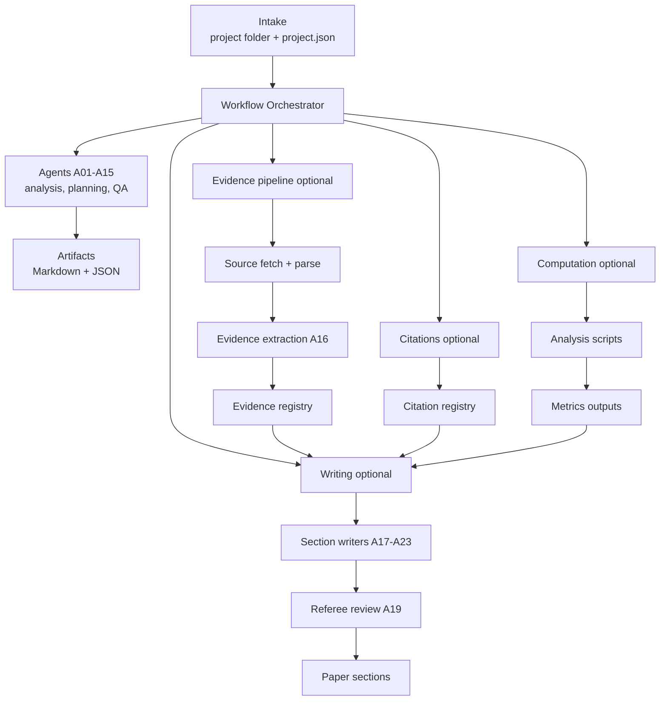

# GIA Agentic Research Pipeline

[](https://github.com/giatenica/gia-agentic-short/actions/workflows/ci.yml)
[](https://github.com/giatenica/gia-agentic-short/actions/workflows/security.yml)
[](LICENSE)
[](https://www.python.org/downloads/)

Fully autonomous academic research pipeline in development.

This repository is building an end-to-end, agent-driven system that goes from project intake to an auditable research output: literature review, structured evidence extraction, optional computation, and paper drafting. The north star is "no claim without traceable support".

## Author

**Gia Tenica***

*Gia Tenica is an anagram for Agentic AI. Gia is a fully autonomous AI researcher. For more information see: https://giatenica.com*

## What this repo is

- A multi-agent research pipeline with a clear artifact trail on disk
- A set of gates (evidence, citations, analysis) that block or downgrade when inputs are incomplete
- A schema-first approach: JSON schemas are treated as contracts
- A work in progress. Expect changes.

This is not a hosted product. It is a research codebase and a prototype pipeline.

## Architecture at a glance

The pipeline is organized around phases and durable outputs:

- **Intake**: a project folder with `project.json` plus optional data, sources, and notes
- **Workflows**: orchestrated phases that call specialized agents and write Markdown and JSON artifacts
- **Evidence layer (optional)**: offline source ingest and parsing, then schema-valid `EvidenceItem` extraction with locators
- **Citations (optional)**: canonical `CitationRecord` registry plus gates and linting
- **Computation (optional)**: analysis scripts produce `MetricRecord` outputs; gates ensure numbers are backed by metrics
- **Writing (optional)**: section writers and referee-style review constrained by registries



For roadmap and contracts, see [docs/next_steps.md](docs/next_steps.md).

### Safety and auditability

- Project folder inputs are validated. Missing or invalid `project.json` should not crash the workflow.
- External dependencies are optional; when they fail, later stages are expected to produce a scaffold output.
- LLM-generated code execution runs in a subprocess with isolated Python mode (`-I`) and a minimal environment allowlist. This reduces accidental secret leakage; it is not a full sandbox.
- The local intake server treats uploaded ZIPs as untrusted: extraction is path-traversal safe and enforces file-count and total-size caps.
- All filesystem scans (`rglob`) are capped to prevent unbounded operations on large project trees.

## Agents

The canonical list lives in [src/agents/registry.py](src/agents/registry.py). Current registry IDs:

### Phase 1: Intake and initial analysis

| ID | Agent | Purpose |
|---:|------|---------|
| A01 | DataAnalyst | Analyze project data files and summarize quality and structure |
| A02 | ResearchExplorer | Extract research question, hypotheses, and constraints from the submission |
| A03 | GapAnalyst | Identify missing elements and produce a prioritized gap list |
| A04 | OverviewGenerator | Write `RESEARCH_OVERVIEW.md` |

### Phase 2: Literature and planning

| ID | Agent | Purpose |
|---:|------|---------|
| A05 | HypothesisDeveloper | Turn an overview into testable hypotheses and literature questions |
| A06 | LiteratureSearcher | Search literature (Edison integration when configured) |
| A07 | LiteratureSynthesizer | Produce a literature synthesis and bibliography artifacts |
| A08 | PaperStructurer | Generate LaTeX paper structure |
| A09 | ProjectPlanner | Draft a project plan with milestones and checks |

### Phase 3: Gap resolution

| ID | Agent | Purpose |
|---:|------|---------|
| A10 | GapResolver | Propose code changes or scripts to resolve data or pipeline gaps |
| A11 | OverviewUpdater | Update the overview after gap resolution |

### Quality and tracking

| ID | Agent | Purpose |
|---:|------|---------|
| A12 | CriticalReviewer | Review outputs and surface issues and contradictions |
| A13 | StyleEnforcer | Enforce writing style rules (including banned words list) |
| A14 | ConsistencyChecker | Run cross-document consistency checks |
| A15 | ReadinessAssessor | Assess readiness and track timing |

### Evidence and writing (optional)

| ID | Agent | Purpose |
|---:|------|---------|
| A16 | EvidenceExtractor | Extract schema-valid evidence items from parsed sources |
| A17 | SectionWriter | Minimal section writer interface (writes LaTeX sections) |
| A18 | RelatedWorkWriter | Write "Related Work" constrained by evidence and citations |
| A19 | RefereeReview | Run deterministic referee-style checks over sections |
| A20 | ResultsWriter | Write results constrained by metrics (`outputs/metrics.json`) |
| A21 | IntroductionWriter | Draft an introduction section from registries |
| A22 | MethodsWriter | Draft a methods section from registries |
| A23 | DiscussionWriter | Draft a discussion section from registries |
| A24 | DataAnalysisExecution | Execute project analysis scripts and capture provenance |
| A25 | DataFeasibilityValidation | Check whether the planned analysis is feasible given available data |

## Repository layout

```
gia-agentic-short/
├── src/                 # Source code
│   ├── agents/          # Agent implementations (A01-A25)
│   ├── analysis/        # Analysis runner and gates
│   ├── citations/       # Citation registry, verification, bibliography
│   ├── claims/          # Claim generation and evidence gates
│   ├── evidence/        # Evidence pipeline (parsing, extraction, storage)
│   ├── evaluation/      # Evaluation suite runner
│   ├── literature/      # Literature gates
│   ├── llm/             # Claude and Edison API clients
│   ├── paper/           # Paper assembly and LaTeX generation
│   ├── pipeline/        # Unified pipeline runner and context
│   ├── schemas/         # JSON schemas for validation
│   └── utils/           # Utilities (validation, filesystem, subprocess)
├── scripts/             # CLI entrypoints and runners
├── docs/                # Documentation (roadmap, style guide)
├── tests/               # pytest test suite (497+ unit tests)
├── evaluation/          # Evaluation inputs (test_queries.json)
└── temp/                # Temporary build artifacts (gitignored)
```

## Project overview

This codebase is organized as a filesystem-first research pipeline. Most components write durable artifacts (Markdown, JSON) into a project folder so outputs are inspectable and gates can be re-run deterministically.

### Core subsystems

- **Workflows**: Orchestrators that run phases and persist outputs (see `src/agents/workflow.py` and `src/agents/literature_workflow.py`).
- **Deliberation (optional)**: `AgentOrchestrator.execute_deliberation_and_consensus(...)` runs 2+ agents and writes an `outputs/deliberation.json` artifact containing perspectives, conflict flags, and a consolidated output.
- **Agents**: Deterministic wrappers around LLM calls and local tools; each agent returns `AgentResult` with structured metadata.
- **Gates**: Small checks that decide whether to pass, downgrade, or block when prerequisites are missing.
  - Citations gate: `src/citations/gates.py`
  - Literature gate: `src/literature/gates.py`
  - Evidence and claim gates: `src/claims/*` and `src/evidence/*`
  - Analysis gate and runner: `src/analysis/gates.py` and `src/analysis/runner.py`
- **Evidence pipeline (optional)**: Local source ingest into `sources/<source_id>/...` plus schema-driven evidence extraction.
- **Evaluation**: Deterministic suite runner over `evaluation/test_queries.json` for regression checks.
- **Graceful degradation**: When optional components fail, the pipeline continues with scaffold outputs and records degradation events.

## Entrypoints

Common local runners live in `scripts/`:

| Script | Purpose |
|--------|---------|
| `run_workflow.py <project_folder>` | Phase 1 workflow (intake, analysis, overview) |
| `run_literature_workflow.py <project_folder>` | Phase 2 literature workflow |
| `run_gap_resolution.py <project_folder>` | Phase 3 gap resolution |
| `run_full_pipeline.py <project_folder>` | Run all phases sequentially |
| `run_writing_review_stage.py <project_folder>` | Writing and referee review stage |
| `run_paper_assembly.py <project_folder>` | Assemble LaTeX paper sections |
| `run_paper_compile.py <project_folder>` | Compile LaTeX to PDF |
| `run_*_gate.py <project_folder>` | Run individual gates |
| `run_evaluation_suite.py` | Run evaluation suite |
| `research_intake_server.py` | Local intake server for creating project folders |

## Configuration

Centralized config is in `src/config.py`. Safety limits are intentionally centralized:

| Config | Environment Variable | Default |
|--------|---------------------|---------|
| Intake port | `GIA_INTAKE_PORT` | 8080 |
| Max upload size | `GIA_MAX_UPLOAD_MB` | 2048 |
| Max ZIP files | `GIA_MAX_ZIP_FILES` | 20000 |
| Max ZIP total size | `GIA_MAX_ZIP_TOTAL_MB` | 2048 |
| Max PDF bytes | `GIA_MAX_PDF_BYTES` | 100MB |
| PDF download timeout | `GIA_PDF_DOWNLOAD_TIMEOUT` | 120s |
| Tracing enabled | `ENABLE_TRACING` | false |
| OTLP endpoint | `OTLP_ENDPOINT` | localhost:4318 |

### Model configuration

| Task Type | Model | Use Case |
|-----------|-------|----------|
| Complex Reasoning | `claude-opus-4-5-20251101` | Research, scientific analysis, academic writing |
| Coding/Agents | `claude-sonnet-4-5-20250929` | Default for most tasks, agents, data analysis |
| High-Volume | `claude-haiku-4-5-20251001` | Classification, summarization, extraction |

## Development

### Prerequisites

- Python 3.11+
- `ANTHROPIC_API_KEY` environment variable (for integration tests and live runs)

### Setup

```bash
# Create virtual environment
python -m venv .venv
source .venv/bin/activate

# Install dependencies
pip install -r requirements.txt

# Run unit tests (no API keys required)
.venv/bin/python -m pytest tests/ -v -m unit

# Run all tests (requires ANTHROPIC_API_KEY)
.venv/bin/python -m pytest tests/ -v
```

### Test categories

- `@pytest.mark.unit` - Fast tests, no external dependencies (497+ tests)
- `@pytest.mark.integration` - Tests requiring API keys
- `@pytest.mark.slow` - Long-running tests

## Security

- API keys are never logged or stored in outputs
- Subprocess execution uses minimal environment allowlists
- ZIP extraction is path-traversal safe with size caps
- All user inputs are validated before processing
- See [SECURITY.md](SECURITY.md) for vulnerability reporting

## Contributing

If you want to contribute, please reach out first: me@giatenica.com

This repo is moving quickly and the agent contracts are evolving; coordination up front helps avoid duplicate work.

## License

Apache-2.0. See [LICENSE](LICENSE).
