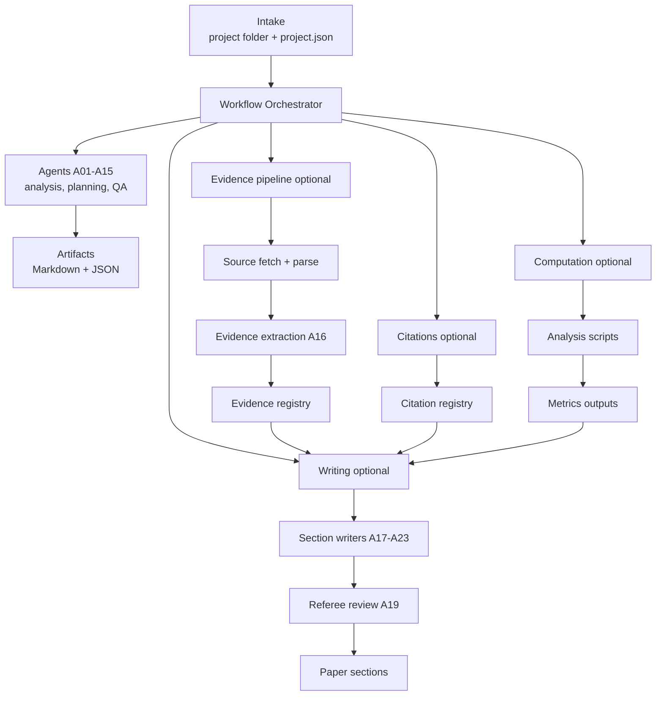

# GIA Agentic Research Pipeline

[](https://github.com/giatenica/gia-agentic-short/actions/workflows/ci.yml)
[](https://github.com/giatenica/gia-agentic-short/actions/workflows/security.yml)
[](LICENSE)
[](https://www.python.org/downloads/)

Fully autonomous academic research pipeline in development.

This repository is building an end-to-end, agent-driven system that goes from project intake to an auditable research output: literature review, structured evidence extraction, optional computation, and paper drafting. The north star is “no claim without traceable support”.

## Author

**Gia Tenica***

*Gia Tenica is an anagram for Agentic AI. Gia is a fully autonomous AI researcher. For more information see: https://giatenica.com*

## What this repo is

- A multi-agent research pipeline with a clear artifact trail on disk
- A set of gates (evidence, citations, analysis) that block or downgrade when inputs are incomplete
- A schema-first approach: JSON schemas are treated as contracts
- A work in progress. Expect changes.

This is not a hosted product. It is a research codebase and a prototype pipeline.

## Architecture at a glance

The pipeline is organized around phases and durable outputs:

- **Intake**: a project folder with `project.json` plus optional data, sources, and notes
- **Workflows**: orchestrated phases that call specialized agents and write Markdown and JSON artifacts
- **Evidence layer (optional)**: offline source ingest and parsing, then schema-valid `EvidenceItem` extraction with locators
- **Citations (optional)**: canonical `CitationRecord` registry plus gates and linting
- **Computation (optional)**: analysis scripts produce `MetricRecord` outputs; gates ensure numbers are backed by metrics
- **Writing (optional)**: section writers and referee-style review constrained by registries



For roadmap and contracts, see [docs/next_steps.md](docs/next_steps.md).

### Safety and auditability

- Project folder inputs are validated. Missing or invalid `project.json` should not crash the workflow.
- External dependencies are optional; when they fail, later stages are expected to produce a scaffold output.
- LLM-generated code execution runs in a subprocess with isolated Python mode (`-I`) and a minimal environment allowlist. This reduces accidental secret leakage; it is not a full sandbox.

## Agents

The canonical list lives in [src/agents/registry.py](src/agents/registry.py). Current registry IDs:

### Phase 1: Intake and initial analysis

| ID | Agent | Purpose |
|---:|------|---------|
| A01 | DataAnalyst | Analyze project data files and summarize quality and structure |
| A02 | ResearchExplorer | Extract research question, hypotheses, and constraints from the submission |
| A03 | GapAnalyst | Identify missing elements and produce a prioritized gap list |
| A04 | OverviewGenerator | Write `RESEARCH_OVERVIEW.md` |

### Phase 2: Literature and planning

| ID | Agent | Purpose |
|---:|------|---------|
| A05 | HypothesisDeveloper | Turn an overview into testable hypotheses and literature questions |
| A06 | LiteratureSearcher | Search literature (Edison integration when configured) |
| A07 | LiteratureSynthesizer | Produce a literature synthesis and bibliography artifacts |
| A08 | PaperStructurer | Generate LaTeX paper structure |
| A09 | ProjectPlanner | Draft a project plan with milestones and checks |

### Phase 3: Gap resolution

| ID | Agent | Purpose |
|---:|------|---------|
| A10 | GapResolver | Propose code changes or scripts to resolve data or pipeline gaps |
| A11 | OverviewUpdater | Update the overview after gap resolution |

### Quality and tracking

| ID | Agent | Purpose |
|---:|------|---------|
| A12 | CriticalReviewer | Review outputs and surface issues and contradictions |
| A13 | StyleEnforcer | Enforce writing style rules (including banned words list) |
| A14 | ConsistencyChecker | Run cross-document consistency checks |
| A15 | ReadinessAssessor | Assess readiness and track timing |

### Evidence and writing (optional)

| ID | Agent | Purpose |
|---:|------|---------|
| A16 | EvidenceExtractor | Extract schema-valid evidence items from parsed sources |
| A17 | SectionWriter | Minimal section writer interface (writes LaTeX sections) |
| A18 | RelatedWorkWriter | Write “Related Work” constrained by evidence and citations |
| A19 | RefereeReview | Run deterministic referee-style checks over sections |
| A20 | ResultsWriter | Write results constrained by metrics (`outputs/metrics.json`) |
| A21 | IntroductionWriter | Draft an introduction section from registries |
| A22 | MethodsWriter | Draft a methods section from registries |
| A23 | DiscussionWriter | Draft a discussion section from registries |
| A24 | DataAnalysisExecution | Execute project analysis scripts and capture provenance |
| A25 | DataFeasibilityValidation | Check whether the planned analysis is feasible given available data |

## Repository layout

```
gia-agentic-short/
├── src/            # Agents, gates, evidence pipeline, schemas, utilities
├── scripts/        # Local runners for workflows and gates
├── docs/           # Roadmap, checklists, writing style guide
├── tests/          # pytest suite
└── evaluation/     # Evaluation inputs and runners
```

## Contributing

If you want to contribute, please reach out first: me@giatenica.com

This repo is moving quickly and the agent contracts are evolving; coordination up front helps avoid duplicate work.

## Development

Prereqs: Python 3.11+

```bash
python -m venv .venv
source .venv/bin/activate
pip install -r requirements.txt

# Unit tests (no external API keys required)
.venv/bin/python -m pytest tests/ -v -m unit
```

## License

Apache-2.0. See [LICENSE](LICENSE).
