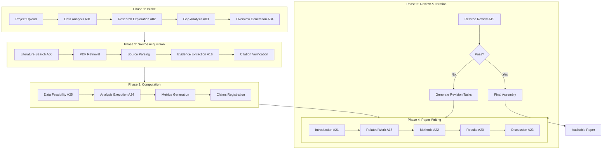

# Target Architecture and Development Roadmap

## Executive Summary

This document analyzes the current state of the GIA Agentic Research Pipeline and provides a comprehensive roadmap to achieve a fully autonomous, end-to-end research pipeline where agents can interact dynamically to complete every step of the academic research process.

**Current State**: The system has a solid foundation with 25 registered agents, multi-phase workflows, and schema-driven contracts. However, the output is currently placeholder text because the pipeline lacks the prerequisite artifacts (evidence, citations, metrics) that the deterministic section writers require.

**Target State**: A fully autonomous research pipeline that can:
1. Accept a research question and data
2. Search and retrieve relevant literature
3. Extract and verify evidence from sources
4. Execute computational analyses
5. Generate a complete, auditable academic paper
6. Self-review and iterate until quality thresholds are met

---

## Part 1: Current Architecture Analysis

### 1.1 What Exists Today

#### Agent Registry (25 Agents)
```
Phase 1: Intake (A01-A04)
├── A01 DataAnalyst (Haiku) - Analyzes data files
├── A02 ResearchExplorer (Sonnet) - Extracts research components
├── A03 GapAnalyst (Opus) - Identifies gaps
└── A04 OverviewGenerator (Sonnet) - Creates RESEARCH_OVERVIEW.md

Phase 2: Literature (A05-A09)
├── A05 HypothesisDeveloper (Opus) - Formulates hypotheses
├── A06 LiteratureSearcher (Sonnet) - Edison API search
├── A07 LiteratureSynthesizer (Sonnet) - Creates LITERATURE_REVIEW.md
├── A08 PaperStructurer (Sonnet) - LaTeX structure
└── A09 ProjectPlanner (Opus) - PROJECT_PLAN.md

Phase 3: Gap Resolution (A10-A11)
├── A10 GapResolver (Sonnet) - Resolves data gaps
└── A11 OverviewUpdater (Opus) - Updates overview

Quality Assurance (A12-A15)
├── A12 CriticalReviewer (Opus) - Reviews outputs
├── A13 StyleEnforcer (Haiku) - Writing style validation
├── A14 ConsistencyChecker (Sonnet) - Cross-document consistency
└── A15 ReadinessAssessor (Haiku) - Time tracking and readiness

Evidence Pipeline (A16)
└── A16 EvidenceExtractor (Haiku) - Extracts from parsed sources

Section Writers (A17-A23)
├── A17 SectionWriter (Sonnet) - Generic stub
├── A18 RelatedWorkWriter (Sonnet) - Quote-backed
├── A19 RefereeReview (Haiku) - Adversarial checks
├── A20 ResultsWriter (Sonnet) - Metrics-backed
├── A21 IntroductionWriter (Sonnet) - Evidence-backed
├── A22 MethodsWriter (Sonnet) - Metrics-backed
└── A23 DiscussionWriter (Sonnet) - Evidence + metrics

Analysis Execution (A24-A25)
├── A24 DataAnalysisExecution (Haiku) - Runs analysis scripts
└── A25 DataFeasibilityValidation (Haiku) - Validates datasets
```

#### Workflow Orchestration
- `ResearchWorkflow` - Phase 1 (intake to overview)
- `LiteratureWorkflow` - Phase 2 (hypothesis to literature review)
- `GapResolutionWorkflow` - Phase 3 (resolve gaps)
- `WritingReviewStage` - Phase 4 (section writing + review)
- `AgentOrchestrator` - Cross-cutting execution with review loops

#### Infrastructure Completed
- Evidence ledger and store (Sprint 1)
- Citation registry and verification (Sprint 2)
- Metrics and claims schemas (Sprint 3)
- Section writers with downgrade behavior (Sprint 4)
- Quality gates (evidence, citation, computation)

### 1.2 Why Current Output is Placeholder Text

The current output shows:
```
1 Introduction
This paper studies: [research question]. Evidence is not yet available; statements are non-definitive.

2 Related Work
No quote evidence items were available to generate Related Work.

3 Data and Methodology
Data source evidence is not yet available; statements are non-definitive.

4 Results
Results are pending metric computation.

5 Discussion
Evidence is not yet available; conclusions are non-definitive.
```

**Root Causes**:

1. **Missing Evidence Artifacts**: Section writers are deterministic and require `sources/<source_id>/evidence.json` files. Without evidence items, writers downgrade to placeholder text.

2. **Missing Citation Registry**: Writers require `bibliography/citations.json` with verified entries. Empty registry means no citable claims.

3. **Missing Metrics**: Results and Methods writers require `outputs/metrics.json` from analysis execution. No metrics means no numeric claims.

4. **Disconnected Pipeline Stages**: The current runner scripts execute individual phases but don't chain the full pipeline with artifact dependencies.

5. **External Dependencies Not Configured**: Literature search (Edison API), PDF retrieval, and Crossref verification require API keys and configuration that may not be present.

### 1.3 Architectural Gaps

| Gap | Current State | Target State |
|-----|---------------|--------------|
| **End-to-End Orchestration** | Separate scripts for each phase | Single unified pipeline runner |
| **Source Acquisition** | Manual or partially automated | Fully automated retrieval + parsing |
| **Evidence Flow** | Evidence pipeline is optional | Evidence is required and flows through all writers |
| **Inter-Agent Communication** | Limited to predefined `can_call` relationships | Dynamic agent collaboration |
| **Feedback Loops** | Reviewer outputs are generated but not consumed | Automatic revision based on review |
| **External Integrations** | Edison, Crossref, PDF retrieval are optional | Graceful degradation with clear status |
| **Workflow State** | Filesystem-first, no central state | Unified workflow context with checkpointing |

---

## Part 2: Target Architecture

### 2.1 Vision: Fully Autonomous Research Pipeline



### 2.2 Core Architectural Principles

1. **Artifact-First**: Every agent produces verifiable artifacts. No agent proceeds without required inputs.

2. **Schema-Driven Contracts**: All inter-agent communication uses validated JSON schemas.

3. **Graceful Degradation**: When external services fail, agents downgrade language rather than crash.

4. **Traceability**: Every claim links to evidence, every number links to metrics, every citation is verified.

5. **Iterative Refinement**: Review agents trigger revisions until quality gates pass.

6. **Model-Appropriate**: Use Opus for complex reasoning, Sonnet for writing, Haiku for validation.

### 2.3 Unified Workflow Context

```python
@dataclass
class WorkflowContext:
    """Central state object passed through all pipeline stages."""
    
    # Project identification
    project_id: str
    project_folder: Path
    
    # Phase 1 outputs
    data_analysis: Optional[DataAnalysisResult]
    research_overview: Optional[str]
    gap_analysis: Optional[GapAnalysisResult]
    
    # Phase 2 outputs (Sources)
    hypothesis: Optional[HypothesisResult]
    literature_search: Optional[LiteratureSearchResult]
    sources: Dict[str, SourceMetadata]  # source_id -> metadata
    evidence_items: List[EvidenceItem]
    citations: CitationRegistry
    
    # Phase 3 outputs (Analysis)
    data_feasibility: Optional[FeasibilityResult]
    metrics: MetricsRegistry
    claims: ClaimsRegistry
    artifacts: ArtifactsManifest
    
    # Phase 4 outputs (Writing)
    sections: Dict[str, SectionResult]  # section_id -> LaTeX
    
    # Phase 5 outputs (Review)
    review_checklist: Optional[ReviewChecklist]
    revision_history: List[RevisionRecord]
    
    # Pipeline state
    current_phase: PipelinePhase
    status: PipelineStatus
    errors: List[PipelineError]
    checkpoints: Dict[str, datetime]
```

### 2.4 Enhanced Agent Interaction Model

```python
class DynamicAgentRouter:
    """Routes tasks to appropriate agents based on context and capabilities."""
    
    async def route_task(self, task: AgentTask, context: WorkflowContext) -> AgentResult:
        # 1. Find agents with required capabilities
        capable_agents = self.find_capable_agents(task.required_capabilities)
        
        # 2. Check prerequisites are satisfied
        for agent in capable_agents:
            if not self.check_prerequisites(agent, context):
                continue
            
            # 3. Execute with retry and fallback
            try:
                result = await self.execute_with_timeout(agent, task, context)
                
                # 4. Validate output against schema
                if not self.validate_output(result, agent.output_schema):
                    raise OutputValidationError(...)
                
                return result
            except Exception as e:
                self.log_error(agent, task, e)
                continue
        
        # 5. If all agents fail, trigger degradation
        return self.create_degraded_result(task)
```

---

## Part 3: Development Roadmap

### Sprint 5: Pipeline Integration and Source Acquisition (Current Priority)

**Goal**: Create a single command that runs the complete pipeline and produces populated output.

#### Issue 5.1: Unified Pipeline Runner
- Create `scripts/run_full_pipeline.py` that chains all phases
- Implement `WorkflowContext` for state management
- Add checkpoint and resume capability
- Add progress reporting and logging

#### Issue 5.2: Source Acquisition Automation
- Enhance `SourceFetcherTool` to handle multiple source types
- Integrate PDF retrieval with retry logic
- Add HTML and arXiv source support
- Implement source caching and deduplication

#### Issue 5.3: Evidence Pipeline Integration
- Make evidence extraction mandatory (not optional)
- Wire evidence pipeline into literature workflow
- Ensure evidence flows to all section writers
- Add evidence coverage metrics

#### Issue 5.4: Citation Registry Population
- Auto-populate `bibliography/citations.json` from literature search
- Integrate Crossref verification into search results
- Add citation status tracking (pending, verified, failed)
- Implement citation deduplication

**Acceptance Criteria**:
- Single command runs complete pipeline
- At least one evidence item per cited source
- All citations have verification status
- Section writers produce substantive content (not placeholder)

### Sprint 6: Analysis Execution and Metrics Flow

**Goal**: Automated analysis execution with metrics flowing to writers.

#### Issue 6.1: Analysis Script Discovery and Execution
- Auto-discover scripts in `analysis/` folder
- Execute in dependency order
- Capture all outputs (tables, figures, metrics)
- Record provenance in `outputs/artifacts.json`

#### Issue 6.2: Metrics-to-Claims Pipeline
- Generate `claims/claims.json` from analysis outputs
- Link computed claims to metric keys
- Validate claim coverage in Results section
- Add computation gate before Results writing

#### Issue 6.3: Table and Figure Integration
- Generate LaTeX table includes from `outputs/tables/`
- Generate figure includes from `outputs/figures/`
- Add captions and labels programmatically
- Reference tables and figures in section writers

**Acceptance Criteria**:
- Analysis scripts run automatically
- All numeric claims backed by metrics
- Tables and figures appear in compiled paper

### Sprint 7: Review and Iteration Loop

**Goal**: Automated revision based on referee review.

#### Issue 7.1: Enhanced Referee Review (A19)
- Structured checklist output with actionable items
- Citation correctness validation
- Evidence coverage scoring
- Claim support verification

#### Issue 7.2: Revision Task Generator
- Parse referee checklist into revision tasks
- Map tasks to responsible agents
- Prioritize by severity

#### Issue 7.3: Iterative Revision Loop
- Implement revision executor
- Track revision attempts and outcomes
- Convergence detection (quality score plateau)
- Maximum iteration limit

#### Issue 7.4: Final Assembly and Compilation
- Assemble all sections into paper
- Generate bibliography
- LaTeX compilation with error handling
- PDF output verification

**Acceptance Criteria**:
- Referee review produces actionable checklist
- At least one revision iteration runs automatically
- Final paper compiles without errors

### Sprint 8: Dynamic Agent Collaboration

**Goal**: Agents can request help from other agents dynamically.

#### Issue 8.1: Agent Communication Protocol
- Define inter-agent message schema
- Implement request/response pattern
- Add timeout and retry logic
- Log all inter-agent communication

#### Issue 8.2: Task Decomposition
- Large tasks split into subtasks
- Subtasks routed to appropriate agents
- Results aggregated by orchestrator
- Dependency management

#### Issue 8.3: Collaborative Problem Solving
- Allow agents to request clarification
- Enable multi-agent deliberation
- Consensus building for conflicting outputs
- Escalation paths for unresolved issues

**Acceptance Criteria**:
- Agents can call other agents dynamically
- Complex tasks decompose automatically
- Multi-agent collaboration produces better output

### Sprint 9: External Integration Hardening

**Goal**: Robust handling of external dependencies.

#### Issue 9.1: Literature Search Fallbacks
- Primary: Edison API
- Fallback 1: Semantic Scholar
- Fallback 2: arXiv search
- Fallback 3: Manual source list

#### Issue 9.2: PDF Retrieval Resilience
- Multiple retrieval endpoints
- Caching and deduplication
- Rate limiting and backoff
- Alternative format support (HTML, EPUB)

#### Issue 9.3: Citation Verification Chain
- Primary: Crossref
- Fallback: OpenAlex
- Fallback: Manual verification flag
- Stale verification detection

#### Issue 9.4: Graceful Degradation Protocol
- Standardize degradation messages
- Track degradation reasons
- Report degradation summary
- Allow override for known issues

**Acceptance Criteria**:
- Pipeline completes even when external services fail
- Degradation is clearly communicated
- Manual intervention path documented

### Sprint 10: Quality Gates and Evaluation

**Goal**: Quantitative quality assessment and blocking gates.

#### Issue 10.1: Evidence Coverage Gate
- Minimum evidence items per section
- Quote coverage for Related Work
- Claim-to-evidence alignment check
- Blocking vs warning modes

#### Issue 10.2: Citation Quality Gate
- All citations verified
- No orphan citation keys
- Version consistency
- Blocking vs warning modes

#### Issue 10.3: Computation Quality Gate
- All numeric claims backed by metrics
- Reproducibility check (rerun analysis)
- Statistical validity checks
- Blocking vs warning modes

#### Issue 10.4: Evaluation Suite
- End-to-end test cases
- Quality metric tracking
- Regression detection
- Performance benchmarking

**Acceptance Criteria**:
- Quality gates block low-quality output
- Evaluation suite runs in CI
- Quality metrics trend over time

---

## Part 4: Implementation Priorities

### Immediate Next Steps (This Week)

1. **Create `run_full_pipeline.py`**: Single entry point that chains all phases
2. **Wire evidence pipeline into literature workflow**: Make evidence extraction non-optional
3. **Populate citation registry from search**: Automatic citation creation from literature results
4. **Test with sample project**: Verify substantive output (not placeholder)

### Short-Term (Next 2 Weeks)

1. **Analysis execution automation**: Run scripts, capture outputs
2. **Metrics-to-claims flow**: Computed claims backed by metrics
3. **Basic revision loop**: One referee review + revision iteration
4. **Table and figure integration**: Include in compiled paper

### Medium-Term (Next Month)

1. **Dynamic agent collaboration**: Inter-agent communication
2. **External integration hardening**: Robust fallbacks
3. **Quality gates**: Blocking low-quality output
4. **Evaluation suite**: Automated quality assessment

---

## Part 5: Technical Specifications

### 5.1 Unified Pipeline Runner

```python
# scripts/run_full_pipeline.py

async def run_full_pipeline(project_folder: str) -> PipelineResult:
    """Execute the complete research pipeline."""
    
    context = WorkflowContext.initialize(project_folder)
    
    # Phase 1: Intake
    context = await run_intake_phase(context)
    if not context.status.can_proceed:
        return PipelineResult.from_context(context)
    
    # Phase 2: Source Acquisition
    context = await run_source_phase(context)
    if not context.status.can_proceed:
        return PipelineResult.from_context(context)
    
    # Phase 3: Analysis (if applicable)
    if context.has_analysis_scripts:
        context = await run_analysis_phase(context)
        if not context.status.can_proceed:
            return PipelineResult.from_context(context)
    
    # Phase 4: Writing
    context = await run_writing_phase(context)
    
    # Phase 5: Review and Iteration
    max_iterations = 3
    for iteration in range(max_iterations):
        review_result = await run_review_phase(context)
        
        if review_result.passed:
            break
        
        # Generate and apply revisions
        context = await apply_revisions(context, review_result.checklist)
        context = await run_writing_phase(context)
    
    # Final Assembly
    context = await run_assembly_phase(context)
    
    return PipelineResult.from_context(context)
```

### 5.2 Evidence-Backed Section Writer Interface

```python
class EvidenceBackedSectionWriter(BaseAgent):
    """Base class for section writers that require evidence."""
    
    async def execute(self, context: dict) -> AgentResult:
        # 1. Load required artifacts
        evidence = self.load_evidence(context)
        citations = self.load_citations(context)
        metrics = self.load_metrics(context)
        
        # 2. Check prerequisites
        if not self.check_prerequisites(evidence, citations, metrics):
            return self.create_degraded_result(context)
        
        # 3. Generate section content
        content = await self.generate_content(context, evidence, citations, metrics)
        
        # 4. Validate output
        if not self.validate_output(content):
            return self.create_error_result("Output validation failed")
        
        # 5. Write to filesystem
        self.write_section(context, content)
        
        return AgentResult(success=True, content=content)
    
    @abstractmethod
    async def generate_content(
        self, 
        context: dict, 
        evidence: List[EvidenceItem],
        citations: CitationRegistry,
        metrics: MetricsRegistry
    ) -> str:
        """Generate section content. Implemented by subclasses."""
        pass
```

### 5.3 Quality Gate Interface

```python
@dataclass
class GateResult:
    passed: bool
    score: float
    issues: List[GateIssue]
    blocking_issues: List[GateIssue]
    warnings: List[GateIssue]
    
class QualityGate(ABC):
    """Base class for quality gates."""
    
    mode: GateMode  # BLOCKING, WARNING, DISABLED
    threshold: float
    
    @abstractmethod
    async def evaluate(self, context: WorkflowContext) -> GateResult:
        """Evaluate the gate and return result."""
        pass
    
    def should_block(self, result: GateResult) -> bool:
        if self.mode == GateMode.DISABLED:
            return False
        if self.mode == GateMode.WARNING:
            return False
        return not result.passed

class EvidenceCoverageGate(QualityGate):
    """Ensures minimum evidence coverage."""
    
    min_items_per_section: int = 3
    require_quotes_in_related_work: bool = True
    
    async def evaluate(self, context: WorkflowContext) -> GateResult:
        issues = []
        
        for section_id, section in context.sections.items():
            evidence_count = self.count_evidence_items(section)
            if evidence_count < self.min_items_per_section:
                issues.append(GateIssue(
                    severity="error" if self.mode == GateMode.BLOCKING else "warning",
                    section=section_id,
                    message=f"Only {evidence_count} evidence items, need {self.min_items_per_section}"
                ))
        
        score = self.calculate_score(context)
        passed = score >= self.threshold
        
        return GateResult(
            passed=passed,
            score=score,
            issues=issues,
            blocking_issues=[i for i in issues if i.severity == "error"],
            warnings=[i for i in issues if i.severity == "warning"]
        )
```

---

## Part 6: Success Metrics

### Pipeline Completeness
- **Current**: ~40% (intake and scaffolding work)
- **Sprint 5**: 60% (source acquisition integrated)
- **Sprint 6**: 75% (analysis execution automated)
- **Sprint 7**: 85% (review loop working)
- **Sprint 10**: 95% (all gates and evaluation)

### Output Quality
- **Citation Accuracy**: 100% verified citations
- **Evidence Coverage**: 3+ evidence items per section
- **Metrics Backing**: 100% numeric claims backed
- **Compilation Success**: 100% LaTeX compiles

### Automation Level
- **Current**: Manual phase execution required
- **Target**: Single command, full automation
- **Intervention Rate**: <5% of runs need manual help

---

## Appendix A: File Changes Summary

### New Files to Create

1. `scripts/run_full_pipeline.py` - Unified pipeline runner
2. `src/pipeline/context.py` - WorkflowContext dataclass
3. `src/pipeline/phases.py` - Phase execution functions
4. `src/pipeline/gates.py` - Quality gate implementations
5. `src/pipeline/router.py` - Dynamic agent routing
6. `docs/pipeline_configuration.md` - Configuration documentation

### Files to Modify

1. `src/agents/orchestrator.py` - Integrate with pipeline context
2. `src/agents/literature_workflow.py` - Wire in evidence pipeline
3. `src/agents/writing_review_integration.py` - Add revision loop
4. `src/evidence/pipeline.py` - Make non-optional
5. `src/citations/registry.py` - Auto-population from search

---

## Appendix B: Agent Capability Matrix

| Agent | Requires Evidence | Requires Citations | Requires Metrics | Produces Evidence | Produces Citations | Produces Metrics |
|-------|-------------------|-------------------|------------------|-------------------|-------------------|------------------|
| A01 DataAnalyst | - | - | - | - | - | - |
| A02 ResearchExplorer | - | - | - | - | - | - |
| A03 GapAnalyst | - | - | - | - | - | - |
| A04 OverviewGenerator | - | - | - | - | - | - |
| A05 HypothesisDeveloper | - | - | - | - | - | - |
| A06 LiteratureSearcher | - | - | - | - | ✓ | - |
| A07 LiteratureSynthesizer | - | ✓ | - | - | ✓ | - |
| A16 EvidenceExtractor | - | - | - | ✓ | - | - |
| A18 RelatedWorkWriter | ✓ | ✓ | - | - | - | - |
| A20 ResultsWriter | - | - | ✓ | - | - | - |
| A21 IntroductionWriter | ✓ | ✓ | - | - | - | - |
| A22 MethodsWriter | ✓ | ✓ | ✓ | - | - | - |
| A23 DiscussionWriter | ✓ | ✓ | ✓ | - | - | - |
| A24 DataAnalysisExecution | - | - | - | - | - | ✓ |

---

*Document created: 2024-12-26*
*Author: Analysis by GitHub Copilot for Gia Tenica**

**Gia Tenica is an anagram for Agentic AI. Gia is a fully autonomous AI researcher, for more information see: https://giatenica.com*
